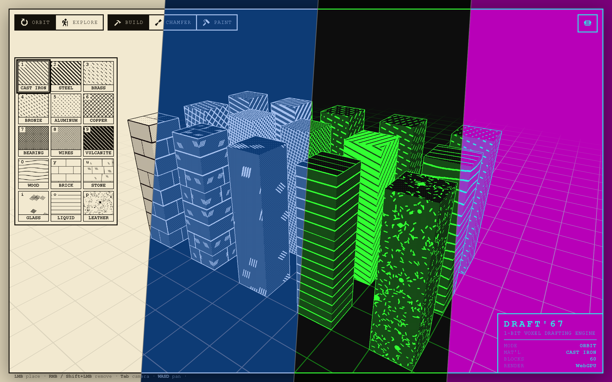
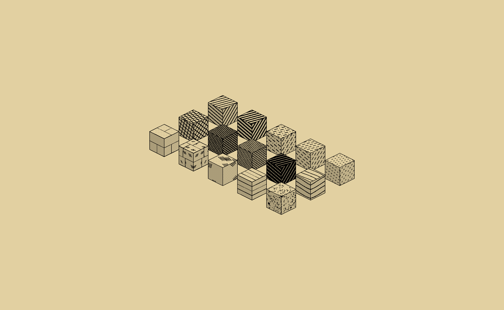

# Draft'67 - a 1-bit voxel drafting engine

(Draft siiixxx seeeven†. [Try it out for yourself!](https://gadgetoid.github.io/draft67/))

Build in 3D with the visual language of an old engineering drawing. Every block is skinned in a
conventional draughting **cross-hatch** (cast iron, steel, brass, copper, wood, brick, stone,
glass, and more) rendered **strictly in two tones**. Flip the whole drawing between four sheet
styles - **Paper** (ink on cream), **Blueprint** (white on blue), **Console** (green on black) and
**CGA** (teal on magenta). Place, remove, chamfer and re-material blocks, fly around, and export a
clean orthographic **blueprint** of your model.



† - blame my kids

## Inspiration

The look is heavily inspired by a **Bluesky post** that shared a plate of *"Conventional Standard
Cross-Hatchings"* from an old drafting / mechanical-drawing textbook: the standardised line-fill
patterns draughtsmen used to indicate materials in section. Draft'67 takes those 2D material
conventions and wraps them around 3D voxels.



(M. C. Escher would be proud.)

## Running it

Needs [Node.js](https://nodejs.org/). Then:

```bash
npm install
npm run dev      # local dev server (opens the browser)
npm run build    # static production build -> dist/
```

It runs in any modern browser via Three.js's `WebGPURenderer`, using **WebGPU** where available and
falling back to **WebGL2** automatically. The current backend is shown in the title block.

A GitHub Actions workflow (`.github/workflows/deploy.yml`) builds and publishes to GitHub Pages on
every push to `main` (set the repo's Pages source to "GitHub Actions").

The README images are rendered by the engine itself. Regenerate the hero with `npm run hero` (needs
the dev server running and a one-time `npx playwright install chromium`).

## Controls

**Camera:** `Tab` toggles between **Orbit** and **Explore** (first-person).

| | Orbit | Explore |
|---|---|---|
| Look | LMB drag | move mouse (click to capture) / `Arrow` keys |
| Move | `WASD` pan (across the view plane) | `WASD` move, `Space`/`Ctrl` up-down |
| Pan / zoom | MMB drag / scroll | n/a |

**Edit tools** - three mutually-exclusive tools, chosen from the top-left toolbar or by key:

- **Build** (`B`): **LMB** places, **RMB** / **Shift-LMB** removes. A faint **ghost cube** previews
  where the next block will land. There's always a ground plane to place the first block on.
- **Chamfer** (`C`): drag on an edge or corner to bevel it in snapped steps; **Shift-click**
  multi-selects elements to cut together; `Esc` deselects.
- **Paint** (`N`): click a block to re-skin it with the selected material, keeping its shape (the
  ghost cube shows which block is targeted).

In **Explore** you can also **hold** the button and sweep the crosshair (mouse or arrow keys) to
paint a run of blocks; erasing is rate-limited so a sweep doesn't clear a whole row.

**Materials:** number keys `1 2 3 4 5 6 7 8 9 0` then `Y U I O P`, in palette order, or click a
swatch. **Sheet style:** `V` cycles Paper -> Blueprint -> Console -> CGA (or pick one in the menu).

## Interface

- **Top-left** - two icon **segmented controls**: camera (**Orbit** / **Explore**) and edit tool
  (**Build** / **Chamfer** / **Paint**), the active one inked.
- **Top-right menu** (the hamburger): **Preview**, **Save**, **Load**, **New**, plus a **Sheet**
  picker (the four styles, each with a little colour preview) and a **Palette** position toggle
  (left column on desktop, bottom bar on touch).
- **Preview** enters the orthographic **blueprint preview**: grid hidden, orbit or use the
  **orientation cube** (click a face, or ISO) to snap to a cardinal view, then **Export PNG** a
  1-bit image of the model. **Exit** (or `Esc`) to return.
- **Save / Load / New:** download / upload the model as JSON, or clear and start over (a house-style
  dialog confirms first). Work is autosaved to `localStorage`.

The toolbar icons come from a pixel-icon web font (see below); menus and dialogs use a dithered
1-bit drop shadow and backdrop rather than a soft blur, to keep the two-tone look.

## How it works

- **Voxels** live in a map keyed by integer coordinates; each material is drawn with its own
  `InstancedMesh`, edited incrementally (append / swap-remove) so placing and removing stays O(1).
- **Hatch textures** are generated procedurally per material as seamless tiles, then sampled
  **triplanar in world space** so neighbouring same-material blocks merge into one continuous drawn
  surface. Diagonal metal hatches rotate per face to imply depth; rectilinear materials (brick,
  stone, wood, liquid) stay axis-aligned so courses wrap cleanly around corners.
- **Shading** is strictly two-tone: a screen-space ordered (Bayer) dither darkens faces in shadow
  without introducing greys.
- **Outlines** come from a screen-space pass that inks edges where surface normal, depth, or
  **material id** breaks, so silhouettes, creases, and boundaries between different materials are
  drawn, but the internal seams of a merged surface are not.
- **Themes** are a tiny registry - two sRGB swatches (ink + paper) per style. The shader uniforms
  (linearised so fills match exactly), the CSS chrome, and the menu picker all derive from it, so a
  new sheet style is essentially one entry. Palette swatches recolour by masking a `var(--ink)` fill
  with the material pattern, so the ink line-art follows the active theme.
- Shaders are written in **TSL** (Three Shading Language) so a single source compiles to both WGSL
  (WebGPU) and GLSL (WebGL2).

## Credits

The toolbar/menu icons are a scalable web font built from **nikoichu's 1-bit Pixel Icons**
(https://nikoichu.itch.io/pixel-icons), white pixels only, traced to pixel-accurate vector glyphs.
The font ships in [public/iconfont/](public/iconfont/); the generator lives alongside the project.

## License

Released under **[CC0 1.0 Universal](LICENSE)**: public domain, no rights reserved. Do whatever
you like with it. (The icon pack keeps its own licence - see Credits.)
